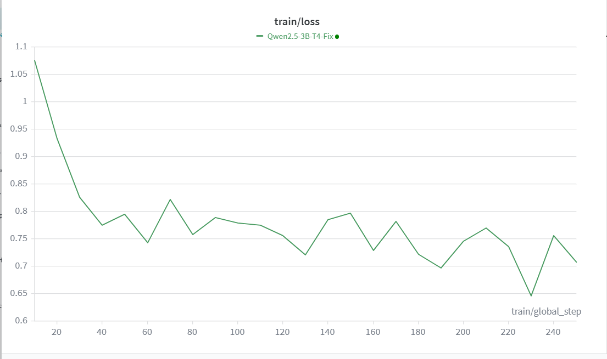

# Fine-Tuning Qwen-2.5-3B on a Tesla T4 GPU (ChatML & LoRA)

This repository contains a Google Colab notebook demonstrating how to successfully fine-tune Alibaba's **Qwen-2.5-3B** base model using a single **Tesla T4 GPU (16GB VRAM)**. 

Because the T4 GPU physically lacks the hardware kernels to process `BFloat16` math (which modern models default to), standard fine-tuning scripts often crash with a `NotImplementedError` during gradient unscaling. This project provides a heavily documented, "ironclad" workflow to bypass these errors using strict `Float16` overrides, parameter scrubbing, and customized training configurations.

## The Dataset: FineTome-100k
This project utilizes a 10,000-example subset of the [mlabonne/FineTome-100k](https://huggingface.co/datasets/mlabonne/FineTome-100k) dataset. 

* **Overview:** FineTome is a highly curated dataset designed to teach models excellent conversational structure, logic, and instruction following. 
* **Structure:** The data consists of multi-turn conversations between a "human" and an "assistant."
* **Preprocessing in this repo:** We map these roles to "user" and "assistant" and wrap them in Qwen's native **ChatML** format (`<|im_start|>` and `<|im_end|>`) to teach the base model how to behave like a chatbot.

---

## Step-by-Step Workflow

### Step 1: Data Preparation & ChatML Formatting
Large Language Models are strict about formatting. Since we are using a Base model, we manually teach it Qwen's ChatML template.
* We load a 10,000-row subset for rapid iteration.
* We apply the `tokenizer.apply_chat_template` to format the raw text.
* The data is split into a robust `90/5/5` ratio for Training, Validation, and Testing.

### Step 2: Token Length Optimization
To prevent Out-Of-Memory (OOM) errors and wasted compute on empty padding, we analyze the distribution of token lengths in our dataset. 
* **Finding:** 95% of our conversations fit within ~1285 tokens.
* **Action:** We set our `max_length` to **1024** to optimize for the T4's 16GB VRAM while preserving the vast majority of context.

### Step 3: 4-Bit Quantization & Model Loading
We load the 3 billion parameter model into memory using `bitsandbytes` NF4 quantization.
* **The T4 Fix:** We explicitly set `bnb_4bit_compute_dtype=torch.float16` and forcefully overwrite the model's internal `torch_dtype` to prevent it from defaulting to `bfloat16`.

### Step 4: Applying LoRA & The "Parameter Scrubber"
We use PEFT to inject Low-Rank Adaptation (LoRA) matrices into the model's attention layers (`q_proj`, `v_proj`, `k_proj`, `o_proj`).
* **The PEFT Bug Fix:** When PEFT initializes new weights, it sometimes pulls `bfloat16` from the original config file, ignoring our previous overrides. 
* **The Solution:** We run a custom "Scrubber" loop over `model.named_parameters()` to hunt down and manually cast any rogue `bfloat16` tensors to `float16` before training begins.

### Step 5: SFTTrainer Configuration (Bypassing the GradScaler)
The `SFTTrainer` manages the training loop, but its Automatic Mixed Precision (AMP) can trigger the T4's `bfloat16` crash via the PyTorch `GradScaler`.
* **The Fix:** We set **both** `fp16=False` and `bf16=False`. Because the base model is quantized in 4-bit, training the tiny LoRA adapters in standard 32-bit precision easily fits in the VRAM and entirely bypasses the GradScaler bug.
* **Hyperparameters:**
  * `per_device_train_batch_size=2` & `gradient_accumulation_steps=8` (Effective Batch Size = 16)
  * `learning_rate=2e-4` with 20 warmup steps.
  * Checkpoints and evaluations occur every 100 steps.

---

## How to Use
1. Open the `.ipynb` file in Google Colab.
2. Ensure your runtime is set to **T4 GPU**.
3. Add your Hugging Face API Token to your Colab Secrets as `HF_TOKEN`.
4. Run all cells. The model will log metrics to Weights & Biases (W&B) and save adapter checkpoints locally.

## Expected Results
By step 150-200, you should observe the Validation Loss dropping into the `0.8 to 0.5` range, indicating the model has successfully learned the ChatML format and the dataset's conversational tone without overfitting.

